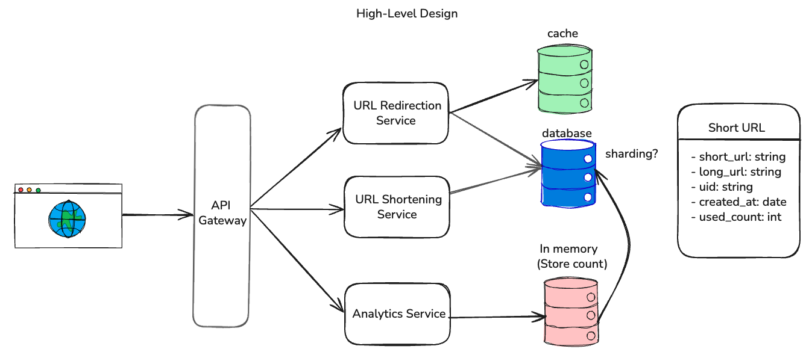

# URL Shortener Service

This is a Spring Boot application that provides a URL shortening service with features like:
- Shortening long URLs to a compact format.
- Redirecting short URLs to their original long URLs.
- Caching URL mappings in Redis for fast lookups.
- Asynchronously recording hit analytics for each short URL using Redis.
- H2 in-memory database for storing URL data, with a console available for inspection.

## Project Structure

- `src/main/java/com/erdem/urlshortener`: Main application code
    - `controller`: REST controllers for API endpoints and redirection.
    - `dto`: Data Transfer Objects for request/response payloads.
    - `entity`: JPA entities (e.g., `ShortUrl`).
    - `exception`: Custom exceptions and handlers.
    - `repository`: Spring Data JPA repositories.
    - `service`: Business logic interfaces and implementations.
- `src/main/resources`: Application configuration and static resources.
    - `application.properties`: Configuration for Spring Boot, Redis, H2, etc.

## High-Level Architecture



The service is designed with a modular approach, consisting of the following key components:

1.  **API Gateway (Conceptual)**: While not explicitly implemented as a separate microservice in this project, incoming requests from clients (e.g., web browsers) are conceptually routed through a single entry point.
2.  **URL Shortening Service**:
    *   Handles requests to create new short URLs.
    *   Generates a unique short path for a given long URL.
    *   Stores the mapping between the short path and the long URL in the primary **Database** (H2 in this implementation).
3.  **URL Redirection Service**:
    *   Handles requests to resolve a short path and redirect to the original long URL.
    *   First, it attempts to retrieve the long URL from a **Cache** (Redis) for fast lookups.
    *   If the URL is not found in the cache (cache miss), it queries the **Database**.
    *   Upon successful retrieval, it caches the mapping for future requests.
4.  **Analytics Service**:
    *   Records usage statistics for each short URL.
    *   When a short URL is successfully redirected, this service asynchronously logs the hit (e.g., timestamp) to an **In-memory Store** (Redis lists in this implementation) for analytics purposes.
5.  **Data Stores**:
    *   **Database (H2)**: The primary persistent store for `ShortUrl` entities, which include the short URL, long URL, UUID, creation date, and usage count.
    *   **Cache (Redis)**: Used by the URL Redirection Service to store `shortPath -> longUrl` mappings for quick retrieval, reducing database load.
    *   **In-memory Store (Redis)**: Used by the Analytics Service to store hit counts and timestamps for each short URL.

The overall flow involves a client sending a request, which is then processed by the appropriate service. The services interact with the database and cache as needed to fulfill the request and record analytics.

## Prerequisites

- Java 21 or later
- Maven
- Redis server (running locally on default port 6379 for caching and analytics)

## How to Run

1.  **Clone the repository (if applicable).**
2.  **Ensure Redis is running:**
    ```sh
    redis-server
    ```
    (Or use `brew services start redis` if installed via Homebrew on macOS)
3.  **Build and run the application using Maven:**
    ```sh
    ./mvnw spring-boot:run
    ```
4.  The application will start on `http://localhost:8080`.

## API Endpoints

### Create a Short URL

- **POST** `/api/shorten`
- **Request Body** (JSON):
  ```json
  {
    "longUrl": "https://your-long-url.com/example/path"
  }
  ```
- **Success Response** (200 OK):
  ```json
  {
    "shortUrl": "http://localhost:8080/api/091bbca4",
    "uuid": "unique-identifier-for-the-url"
  }
  ```

### Redirect Short URL

- **GET** `/{shortPath}`
  - Example: `http://localhost:8080/generatedShortPath`
- **Success Response**: HTTP 302 Redirect to the original long URL.

## H2 Database Console

Once the application is running, you can access the H2 in-memory database console:
1.  Open your browser to `http://localhost:8080/h2-console`.
2.  Ensure the **JDBC URL** is set to `jdbc:h2:mem:testdb`.
3.  Username: `sa`
4.  Password: (leave blank)
5.  Click **Connect**.

You can then browse the `SHORT_URLS` table and other database details.

## Caching and Analytics

- URL mappings are cached in Redis for 1 day to speed up redirection.
- Hit counts and timestamps for each short URL are recorded in Redis lists (e.g., `hits:{shortPath}`).
- If Redis is unavailable, the application will fall back to using the H2 database directly for URL resolution, and caching/analytics writes will be skipped with a warning log.
